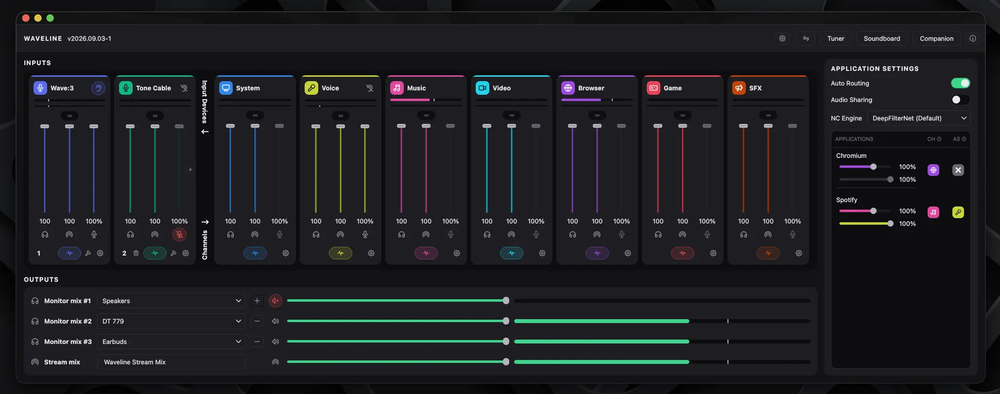
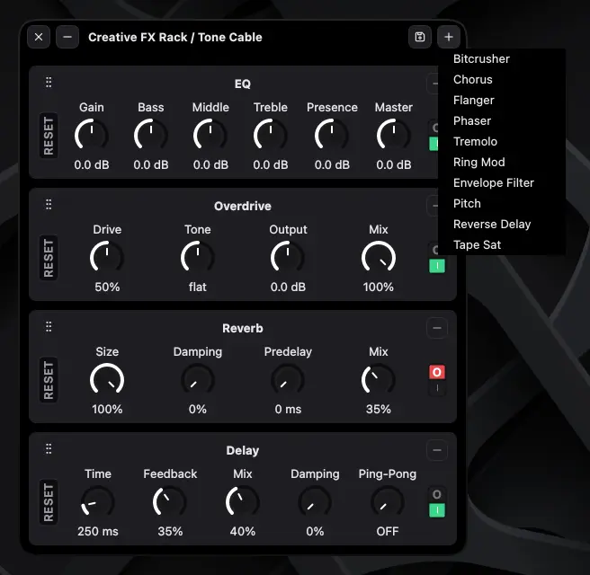
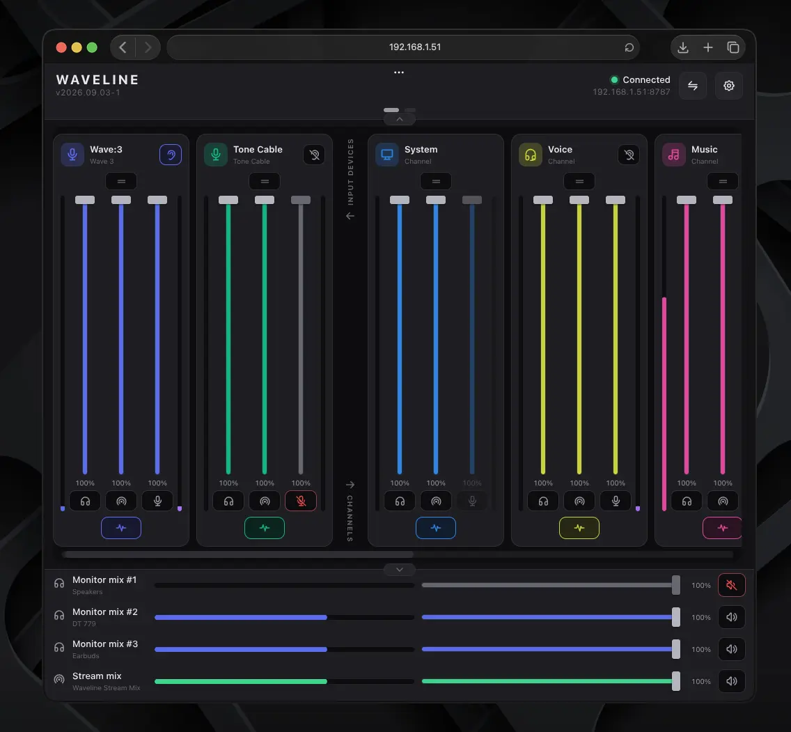

<!-- SPDX-License-Identifier: GPL-2.0-or-later -->
# Waveline

**A Wave Link-style audio mixer for Linux, for any microphone.**

Waveline gives you what streaming mixers give you on Windows — named channels,
a separate **Stream** mix and **Monitor** mix, per-application routing, noise
suppression, EQ and dynamics — built directly on PipeWire, with no proprietary
software and no device lock-in.

None of that is device-specific. What *is* device-specific — a kernel quirk, a
WirePlumber workaround, a vendor USB protocol — lives in a profile under
[`devices/`](devices/), and only the profiles matching hardware you actually
have plugged in get installed.



<table>
<tr>
<td width="50%"></td>
<td width="50%"></td>
</tr>
<tr>
<td align="center"><b>Creative FX Rack</b> — fourteen pedals, reorderable</td>
<td align="center"><b>Web Companion</b> — the mixer on a phone or tablet</td>
</tr>
</table>

Licensed **GPL-2.0-or-later**. See [`LICENSE`](LICENSE).

---

## Install

### Requirements

- A PipeWire-based desktop (PipeWire + WirePlumber)
- Qt 6.4+ (Core, Widgets, DBus, Svg, Network, WebSockets), CMake 3.21+, a
  C++20 compiler
- `librnnoise`, `libpipewire-0.3`
- Kernel headers matching the **running** kernel (only for the DKMS part)

Distro families the installer knows how to install build dependencies on:
**Arch**, **Fedora / RHEL**, **Debian / Ubuntu**. On anything else it says what
it needs and installs everything that does not require a package manager.

> **Tested on Arch Linux only.**
>
> Every install so far has been on Arch. The Fedora and Debian/Ubuntu paths are
> written and reviewed, but nobody has run them end to end — the package names,
> the kernel-headers detection and the DKMS behaviour on those families are
> unverified in practice. The same goes for every atomic distro listed below.
>
> They may well work. If you try one, please
> [open an issue](https://github.com/Nakildias/Waveline/issues) saying whether
> it did — a report either way is genuinely useful, and a failure is a bug
> worth fixing rather than a limitation.

Atomic / image-based distros — **Bazzite, SteamOS, Silverblue, Kinoite,
Bluefin, Aurora, openSUSE MicroOS** — are handled too, and detected
automatically. Nothing is layered onto your image and no reboot is needed:
the toolchain comes from a throwaway container built from your own base
release, and the one optional kernel patch is carried in `/var` instead of
DKMS. The requirement there is a container engine (`podman`, which all of them
ship). See **[`ATOMIC-SUPPORT.md`](ATOMIC-SUPPORT.md)**.

### Quick start

```bash
sudo bash -c "$(curl -fsSL https://raw.githubusercontent.com/Nakildias/Waveline/main/scripts/install-waveline.sh)"
```

That fetches the repository into `~/.cache/waveline-src` and runs the real
installer out of it. It is a script running as root, so read it first if you
would rather not take it on trust — it is
[`scripts/install-waveline.sh`](scripts/install-waveline.sh), and it is short.

Or do the same thing by hand:

```bash
git clone https://github.com/Nakildias/Waveline.git
cd Waveline
sudo ./install.sh
```

Then open the mixer:

```bash
waveline-mixer
```

There is also `wavelined-cli`, one flag per action, for Stream Decks, keybinds
and scripts — see **[`COMMANDS.md`](COMMANDS.md)**.

The daemon (`wavelined`) is enabled and started at the end of the run, so the
mixer works straight afterwards with nothing else to type.

### Plug your microphones in first

**Have the devices you actually use connected before you run the installer.**
Detection happens once, during the run: the installer looks at what is plugged
in, matches it against [`devices/`](devices/), and installs only the fixes for
the hardware it found. A microphone that was unplugged at that moment gets none
of its own.

**Added a new microphone since? Re-run the installer.** It is safe to run as
many times as you like: it re-detects what is plugged in and installs whatever
the new device needs. Work already done is skipped — DeepFilterNet is not
rebuilt if it is already there — though the mixer itself is recompiled each
time, so give it a minute.

Two things worth knowing before you bother:

- **Most microphones need nothing.** The mixer, the channels, the routing and
  the noise suppression are not device-specific and work with anything PipeWire
  can see. Re-running only matters when the new device has a profile in
  [`devices/`](devices/) — otherwise there is nothing extra to install and the
  generic path already covers it.
- **You can install a profile without the device attached** with
  `WAVELINE_PROFILES="wave3"` (see [Options](#options)) — useful when the
  hardware is not to hand, or when preparing a machine for it.

### What the installer does

| Step | What it installs |
|------|------------------|
| 1. Kernel patch | Per matched profile, via DKMS. The Elgato Wave:3 needs one (it fixes the `usb_set_interface -110` lockup); most microphones need none, and then this step does nothing. |
| 2. WirePlumber | Waveline's driver policy on every machine, plus a rule per matched profile |
| 3. PipeWire | Waveline's clock policy on every machine, plus a drop-in per matched profile |
| 4. Real-time scheduling | Permission for the audio threads to outrank ordinary work, on every machine. Without it the mixer is at the mercy of whatever else the CPU is doing. |
| 5. JACK compatibility | Makes `pipewire-jack` the provider of `libjack`, replacing `jack2` if it is installed. Only matters if you use a DAW — but then it matters completely; see below. |
| 6. udev rules | Per matched profile, and only when one ships them. Most do not. |
| 7. Hardware CLI | `waveline-hw`, for controls ALSA does not expose. Only when a matched profile has a vendor protocol. |
| 8. Mixer | `wavelined` + `waveline-mixer`, built from source. FluidSynth is installed from your distribution and copied into `app/lib/` first, for MIDI instrument sounds; skip it with `WAVELINE_SKIP_FLUIDSYNTH=1`. |
| 9. DeepFilterNet | Optional. The better noise-suppression engine, and the default. Built from upstream Rust sources because no distro packages libDF's C API. |

Steps 2–9 are pure userspace and work on any kernel. Step 1 needs matching
kernel headers; if that is not possible the installer says so and still
installs everything else.

Step 9 is the slow one: it downloads a Rust crate graph and compiles it — a
few minutes and ~1 GB of scratch space, removed afterwards.

Everything above lands in `$HOME` and `/etc`, except step 1. That is why atomic
distros need special handling for exactly one of these nine steps and none of
the others — see [`ATOMIC-SUPPORT.md`](ATOMIC-SUPPORT.md).

#### Step 5, and why a DAW breaks without it

A DAW reaches the audio stack through `libjack`, and two different packages
provide it. `pipewire-jack` is a shim: a JACK client joins the PipeWire graph
that is already running and sees Waveline's channels as ports. `jack2` is the
real thing: Ardour starts an actual `jackd`, which opens an ALSA device
*exclusively* — a device PipeWire already owns. Two audio servers then fight
over the same hardware and **everything** on the machine crackles, not just the
DAW.

`jack2` ends up installed on a lot of machines by accident, because `ffmpeg`,
`obs-studio` and `audacity` all pull it in as a dependency and nothing warns
that it has displaced the shim. The symptom — "my audio breaks when I open
Ardour" — reads like a DAW bug and is not one.

The installer checks which package owns `libjack.so.0` and swaps it if needed.
Nothing depending on `jack2` breaks: `pipewire-jack` provides `jack` and
`libjack.so`. Set `WAVELINE_KEEP_JACK2=1` to skip the step entirely, for a
machine deliberately running a real `jackd`.

### Options

```bash
sudo ./install.sh --app-only      # rebuild + install waveline-mixer only
sudo ./install.sh --kernel-only   # rebuild + install the kernel patch only
sudo ./install.sh --help
```

| Environment variable | Effect |
|---|---|
| `WAVELINE_PROFILES="wave3"` | Install a profile's parts without that device plugged in |
| `WAVELINE_NO_AUTOSTART=1` | Install, but do not enable/start `wavelined` |
| `WAVELINE_PRO_AUDIO=1` | Superseded. Pro Audio is now the **Latency** control in the mixer — set it to “Pro Audio (85 ms)”, and set it back afterwards. Kept only so the old instruction tells you where it went |
| `WAVELINE_SKIP_DFN=1` | Skip building DeepFilterNet; the mixer falls back to RNNoise |
| `WAVELINE_SKIP_FLUIDSYNTH=1` | Skip installing and staging FluidSynth; the MIDI instrument channel is then unavailable |
| `WAVELINE_KEEP_JACK2=1` | Leave the JACK implementation alone (step 5), for a machine deliberately running a real `jackd` |
| `WAVELINE_BUILD_IMAGE=…` | Atomic only: base image for the container build environment |
| `WAVELINE_NO_CONTAINER=1` | Atomic only: never containerise; use the host toolchain or fail |
| `WAVELINE_STEAMOS_UNLOCK=1` | SteamOS only: build natively by unlocking `/usr` for the run |

### Uninstall

```bash
sudo bash -c "$(curl -fsSL https://raw.githubusercontent.com/Nakildias/Waveline/main/scripts/install-waveline.sh)" -- --uninstall
```

or, from a clone:

```bash
sudo ./uninstall.sh
```

Removes the kernel module — the DKMS package, or on an atomic system the copy
in `/var` and its boot unit — every profile's drop-ins and udev rules, the
binaries and the services, then reloads the audio stack. Build dependencies are
deliberately left alone, as is the container build image on atomic systems (it
is a cache; the script tells you how to reclaim it). It refuses to unload the
patched module unless a stock `snd-usb-audio` is available to replace it, so you
cannot end up with no USB audio driver at all.

---

## Features

### Mixing and routing

- **Named channels** — System, Voice, Music, Browser, Game, SFX — renameable,
  each with its own level, mute and effects.
- **Dual mixes.** A **Stream mix** (a virtual recording device your streaming
  software captures) and a **Monitor mix** (what you hear), balanced
  independently per channel.
- **Up to 5 Monitor mix outputs**, each with its own destination, level and
  mute — headphones and speakers at once, at different volumes.
- **Multiple input devices.** Add, remove and rebuild capture devices live;
  channels follow.
- **Per-application routing.** Move any playing application onto a channel by
  hand, or let auto-routing place it by name (Discord → Voice, Spotify → Music).
- **Sound sharing.** Send an application's audio *into* the microphone stream,
  so the people you're talking to hear it — with its own independent level.
- **MIDI input** with a FluidSynth instrument backend.

### Processing

- **Noise suppression** — DeepFilterNet (default when available) or RNNoise,
  switchable at runtime, with a strength control.
- **Per-channel and per-device effects**: low-cut filter, EQ, de-esser. The EQ
  has two modes — three tone sliders, or an Advanced panel with ten fully
  parametric bands on a draggable response curve, with presets.
- **Dynamics**: noise gate, compressor with ratio and auto makeup gain, and a
  limiter with an adjustable ceiling.
- **Ducking** — pull other channels down when you speak or when another channel is playing audio.
- **LUFS limiter / ear protection** — caps application loudness using a
  BS.1770-style meter, so a loud video does not remove your hearing.
- **Creative FX** — fourteen effects, described in its own section below.
- **Two independent chains per channel.** A channel's *microphone* side and its
  *app-audio* side each carry their own processing, so a channel can gate and
  compress what you say into it without touching what applications play through
  it.

### The Creative FX Rack

Every input device and every channel carries a **fourteen-effect pedalboard**,
and the Rack is that chain drawn as physical gear — one module per effect,
stacked in a frameless window you can leave open next to whatever you are
playing into.

| | |
|---|---|
| **Tone and drive** | Creative EQ (an amp-style Gain / Bass / Middle / Treble / Presence / Master stack), Overdrive, Tape Saturator, Bitcrusher |
| **Modulation** | Chorus, Flanger, Phaser, Tremolo, Ring Modulator, Envelope Filter (auto-wah) |
| **Pitch and time** | Pitch Shifter, Delay (with damping and ping-pong), Reverse Delay, Reverb (size, damping, predelay) |

- **The chain order is yours.** Drag a module by its grip handle to move it;
  the order you see is the order the audio takes. Reverb before delay and
  delay before reverb are different sounds, and both are one drag apart.
- **Per-module power and reset.** Each unit has its own I/O switch and a RESET
  that restores only its own knobs, so an experiment costs nothing.
- **Add only what you need.** The `+` button adds a module; unused effects are
  not in the window and not in the signal path.
- **Presets.** Save a whole rack under a name and load it onto any other
  device's rack — a preset is inert data, kept client-side in
  `~/.config/waveline/rack-presets.json`, and imports/exports as a file.
- **Where it lives.** Every input device and channel has its pedalboard in the
  **Creative** tab of Global Effects. Input devices get the Rack window on top
  of that — middle-click an input's effects button to open it. The Rack is a
  *separate* chain from that device's ordinary Creative tab, and it is live
  exactly while its window is open: opening the Rack is what puts the device
  into Rack Mode, closing it puts the device back. There is no switch left in
  the wrong position. `wavelined-cli --toggle-rack <input>` does the same from
  a button.
- **Every module is scriptable.** `wavelined-cli --toggle-effects` and
  `--toggle-rack-effect` reach each pedal by name, for a Stream Deck button or
  a keybind — see **[`COMMANDS.md`](COMMANDS.md)**.

### The Soundboard

A rack of sound pads, styled as the same kind of window as the FX Rack.

- **Pads** with a name, a glance-sized waveform, and play/stop — mashable
  without thinking about routing.
- **Trim and level per clip.** Set the in/out points on the waveform and the
  clip's own volume, so a long file becomes exactly the two seconds you wanted.
- **Overlapping playback.** Triggering a sound already playing starts a second
  instance rather than cutting the first off.
- **Board-wide routing.** Which channel it plays on, whether it also joins a
  microphone (so the people you are talking to hear it), and the monitor and
  stream levels are set once for the whole board.
- **A stable 4-digit id per sound**, which is all a Stream Deck button needs:
  `wavelined-cli --soundboard-play 4821`. Also `--soundboard-stop` and
  `--soundboard-stop-all`.
- **Export and import** the whole board, from the Backups tab.
- **Everything is daemon state**, so the same sound fires identically from the
  window, from the CLI, or from a phone.

### The Web Companion

The daemon serves a small installable PWA on one port (`8787` by default) to
any phone or tablet on your network — a second control surface for the mixer,
with no app to install from a store and nothing to pair.

- **The full mixer**, not a remote for it: every channel strip with its
  monitor, stream and microphone levels, mutes, and effects toggles, plus every
  Monitor mix and the Stream mix along the bottom.
- **The Soundboard**, as a page of pads you can actually reach mid-stream.
- **Profiles and settings** — switch profile, change device and per-application
  settings, from the couch.
- **Pushed state, not polling.** A fader moved on the tablet moves the desktop
  meter within a frame or two, over a WebSocket.
- **It works with the mixer window closed**, because the server is in
  `wavelined` and not in the GUI. Turn it on, off, or on at login from the
  Companion panel, which also lists the exact URLs to type — one per address
  the machine answers on, ready to copy.
- **The page is compiled into the daemon**, so it cannot go missing, and one
  port serves both the page and the live protocol: one number to remember and
  one hole in your firewall.
- **There is no password.** The server is off by default and never starts on
  its own, but once started it listens on every interface and anyone who can
  reach the machine on that port can open the companion and change your mixer.
  Leave it stopped on networks you do not control. The panel says the same
  thing next to the switch.

### Around the mixer

- **Profiles.** A profile is a whole mixer setup — levels, mutes, routing,
  effects. Save, rename, switch, import and export them. Switching a profile
  never rewires the graph.
- **Instrument tuner.** Tune from any audio or MIDI input, auto or manual
  string mode, selectable concert pitch — without disturbing your mixer setup.
- **Hardware controls** for microphones that expose them over a vendor USB
  protocol (Elgato Wave:3: Clipguard, direct-monitor blend, headphone jack).
- **Daemon/GUI split.** `wavelined` owns the PipeWire graph and the noise
  filter; the GUI is a pure D-Bus client. Closing the window leaves routing and
  noise suppression running.
- **Update check** in the About window.

### Latency

Waveline treats latency as something to control and measure rather than infer.

- **One nominated clock.** One device in a PipeWire graph is the driver, and
  its interrupt schedules everything else. WirePlumber's stock priorities rank
  capture above playback, so on a machine with a webcam the webcam usually wins
  — a 32 kHz camera clocking a guitar adapter, re-clocking the whole graph when
  it is unplugged. Waveline lowers `priority.driver` on every capture node so
  outputs always outrank inputs, and pins the graph to 48 kHz so it cannot be
  dragged onto a device's own rate.
- **A Latency control**, in the header: Automatic, or a fixed graph cycle from
  0.7 ms to 85 ms. It writes
  PipeWire's `clock.force-quantum`, so it applies to the running graph
  instantly — no restart and no reinstall. This is where Pro Audio support
  lives now. Changing it briefly reopens each input's capture hop, which is
  not optional: a quantum change can otherwise leave an ALSA capture resampler
  in a permanent resync loop, audible as robotic input until that input is
  rebuilt. If a low setting sounds broken, re-test it — a floor found while
  that bug was live is a measurement of the bug, not of your hardware.
- **Using a DAW? Set the Latency control to Automatic.** Every other setting
  pins `clock.force-quantum`, and a pinned quantum overrides the buffer size a
  JACK client asks for. Ardour, Reaper and Bitwig are then held at whatever the
  mixer chose, their own buffer-size control silently stops doing anything, and
  the result is crackling that looks like it comes from the DAW. Automatic is
  the one setting that leaves the graph free to negotiate, which hands that
  choice back. This is the other half of step 5 above; the two are always hit
  together.
- **Real-time scheduling, for all of it.** A small graph cycle is only worth
  asking for if the threads can meet it. At 10.7 ms an ordinary thread makes its
  deadline even on a loaded machine; at 2.7 ms it does not, and the difference
  is heard as clicks the moment a game or an encode takes the CPU. PipeWire will
  schedule its threads itself given `RLIMIT_RTPRIO`, and otherwise has to ask
  rtkit — which grants 25 threads per user, against the ~100 a full Waveline
  graph runs, and leaves the rest to be starved. The installer grants the
  rlimit, on every machine, exactly as the `realtime-privileges` package does.
  **Audio diagnostics** reports how many audio threads actually got it, so this
  is something you can check rather than assume.
- **Measured, not calculated.** Each input's delay is the median of recent
  readings of ALSA's own `delay` for that device, taken from
  `/proc/asound`. Hover an input's number badge, or open **Audio diagnostics**
  next to the Latency control for the whole picture — per-device delay, the
  graph cycle, and which node is currently driving the graph.
- **Devices that hide their latency.** Hardware doing its own processing (a
  conference camera, a headset with onboard AEC) decides its delay somewhere
  this machine cannot see, and its capture-side figure would rank it *above*
  genuinely faster microphones. Those inputs are flagged in their device
  profile and read **N/A** rather than a misleading number.
- **What it does not cover.** The figure is capture-side: it starts when the
  device hands audio to this machine. A camera or headset running its own noise
  suppression can add far more upstream, invisibly. `scripts/latency-offset-test.sh`
  measures that directly by recording two devices straight from ALSA and
  cross-correlating a clap; `scripts/latency-sweep.sh` sweeps buffer settings
  and soaks each one.

### Hardware profiles in-tree

| Vendor | Device | Path |
|---|---|---|
| Elgato | Wave:3 | `devices/elgato/microphones/wave3/` |
| Elgato | 4K60 Pro MK.2 | `devices/elgato/capture-cards/4k60mk2/` |
| Elgato | 4K Pro | `devices/elgato/capture-cards/4kpro/` |
| Logitech | C922 | `devices/logitech/microphones/c922/` |
| OBSBOT | Meet 4K | `devices/obsbot/microphones/meet4k/` |
| Antlion | ModMic Wireless | `devices/antlion/microphones/modmicwireless/` |
| Hercules | Rocksmith Tone Cable | `devices/hercules/microphones/rocksmith-tone-cable/` |
| — | Generic fallback | `devices/generic/` |

Anything not listed still works through the generic profile — the mixer itself
is not device-specific.

---

## Contributing

Issues and pull requests: <https://github.com/Nakildias/Waveline>.
**[`CONTRIBUTING.md`](CONTRIBUTING.md)** covers development builds, where the
code lives, and how things are tested.

Everything is `SPDX-License-Identifier: GPL-2.0-or-later`; keep the header on
new files. Contributions are accepted under that licence.

### Adding a new device

**[`devices/README.md`](devices/README.md) is the full guide — read it first.**
`devices/` is the *only* place new hardware support belongs. Profiles are
discovered automatically, so a normal new mic, mixer or capture card needs **no
installer edits**.

The short version:

1. **Identify the hardware** with it plugged in — `lsusb`, `lspci -nn`,
   `pw-cli ls Node`, `wpctl status`, `cat /proc/asound/cards`. Never invent
   USB/PCI IDs, ALSA node names, or quirks.
2. **Create the profile tree:**
   ```bash
   mkdir -p devices/<brand>/<category>/<id>
   cp devices/generic/device.conf devices/<brand>/<category>/<id>/device.conf
   ```
   `<category>` is `microphones`, `capture-cards` or `mixers`. `PROFILE_ID`
   must equal the directory name.
3. **Fill in `device.conf`** — `PROFILE_ID`, `PROFILE_LABEL`, `BRAND`,
   `USB_IDS` / `PCI_IDS`, `ALSA_NODE_MATCH`. Leave the optional keys empty.
   Add the capture node prefix and display brand to
   `app/src/engine/masterbus.h` so strips are named correctly.
4. **Add WirePlumber / PipeWire / udev / kernel drop-ins only with evidence**
   that they are needed. Never copy another device's workarounds onto hardware
   that does not need them.
5. **Smoke-test discovery** with `scripts/lib/profiles.sh`
   (`profile_resolve`, `profile_present`, `profile_detect`) — see the guide.
6. **Test on real hardware.** "Config looks right" is not support.

Two more documents are required reading before you post a profile:

- **[`devices/TROUBLESHOOTING.md`](devices/TROUBLESHOOTING.md)** — evidence-driven
  guide for intermittent robotic / metallic / pitch-shifted capture audio.
- **[`devices/VERIFY_BEFORE_POSTING.md`](devices/VERIFY_BEFORE_POSTING.md)** —
  the human verification matrix: **20 daemon startups, 20 physical hotplugs per
  device, and 20 Rebuild actions per device, with ≥99% success in every
  category.** A human must run this; an agent cannot sign it off.

### Using an AI agent to add your device

Paste this into Claude / Cursor with the device plugged in:

> Read `devices/README.md`, `devices/TROUBLESHOOTING.md`, and
> `devices/VERIFY_BEFORE_POSTING.md` in this repo end-to-end. Add Waveline
> support for my hardware: **&lt;full product name&gt;** (microphone / mixer /
> capture card). Follow the layout, fill `device.conf` correctly, add
> WirePlumber / udev / kernel bits only if evidence shows they are needed, run
> the agent testing checklist yourself, then walk me through the required human
> verification and wait for my results before calling it done.

### Opening the PR

Include, in the description:

- Full product name and the `vid:pid` / `[vid:pid]` you found
- The output that proves detection (`profile_detect`, `wpctl status`)
- Which optional drop-ins you added and **the evidence that made them
  necessary**
- Your results from `VERIFY_BEFORE_POSTING.md`
- Any known gaps you are asking to have accepted

### What not to do

- Do not create empty category folders "for later".
- Do not set `HARDWARE_CONTROLS=1` without a real vendor protocol in the daemon.
- Do not change `install.sh` for a normal new profile — discovery is automatic.
- Do not commit secrets or machine-specific paths in `device.conf`.

---

## Thanks, and third-party licences

Waveline stands on other people's work. A full, per-component inventory —
including *why* each licence is compatible with GPL-2.0-or-later, and how each
component reaches you — is in **[`THIRD-PARTY.md`](THIRD-PARTY.md)**. Verbatim
licence texts are in **[`LICENSES/`](LICENSES/)**.

| Project | Licence | How it reaches you |
|---|---|---|
| [PipeWire](https://pipewire.org/) | MIT | Linked at build time against the system `libpipewire-0.3`. The whole mixer is built on it. |
| [RNNoise](https://github.com/xiph/rnnoise) — Jean-Marc Valin, Xiph.Org, Mozilla, Amazon, Mark Borgerding | BSD-3-Clause | Linked at build time against the system `librnnoise`. Not redistributed here. |
| [DeepFilterNet](https://github.com/Rikorose/DeepFilterNet) — Hendrik Schröter | MIT **or** Apache-2.0 (taken under **MIT**) | `dlopen`ed at runtime from the system `libdf.so`. Not redistributed here and not a build dependency. |
| [tract](https://github.com/sonos/tract) — Sonos | MIT / Apache-2.0 | Inside libDF; runs the DeepFilterNet model. Not this project's to convey. |
| [Qt 6](https://www.qt.io/) | LGPL-3.0-only | Linked at build time against the system Qt. **This is why Waveline is GPL-2.0-or-*later*** — see `THIRD-PARTY.md`. |
| [FluidSynth](https://www.fluidsynth.org/) | LGPL-2.1-or-later | Optional MIDI instrument backend, `dlopen`ed at runtime (or linked if a copy is present in `app/lib/`). |
| [dr_wav / dr_mp3](https://github.com/mackron/dr_libs) — David Reid | Unlicense **or** MIT-0, at your option | **Copied into this repository** under `app/lib/thirdparty/` and compiled into `wavelined`; they decode the Soundboard's audio files. |
| [Tabler Icons](https://github.com/tabler/tabler-icons) — © 2020–2026 Paweł Kuna | MIT | **Copied into this repository** under `app/src/icons/` and compiled into `waveline-mixer`. [`LICENSES/TablerIcons-MIT.txt`](LICENSES/TablerIcons-MIT.txt) must travel with any copy of this repo or a binary built from it. |
| [Linux kernel](https://kernel.org/) `snd-usb-audio` | GPL-2.0-only | `scripts/prepare-src.sh` patches the kernel's own sources; the resulting DKMS module is a derivative of the kernel and is conveyed as GPL-2.0-only. |

The interface is modelled on Elgato's **Wave Link**. Waveline is not affiliated
with, endorsed by, or derived from Elgato or Corsair; no Elgato code or assets
are included, and product names are used only to identify hardware.
